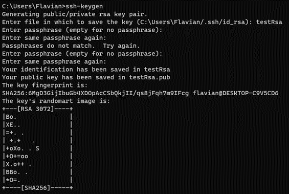
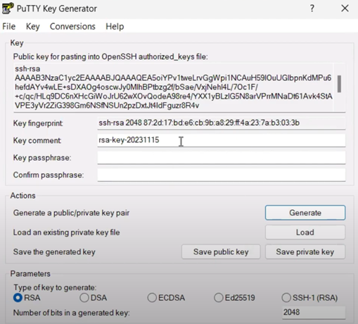
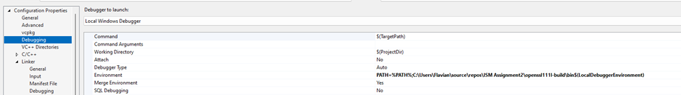
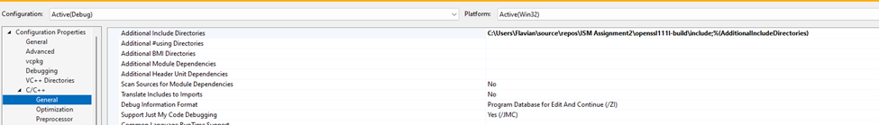
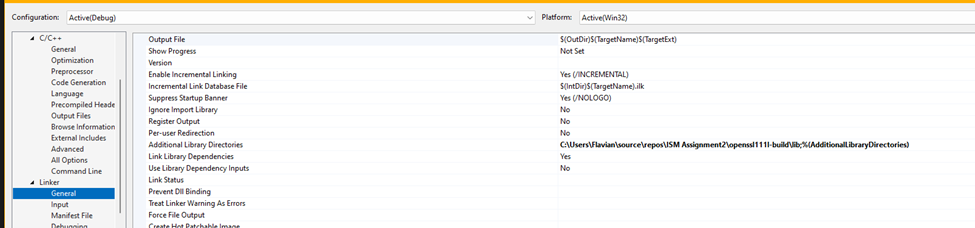
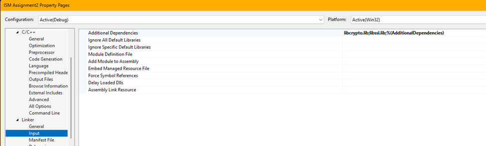
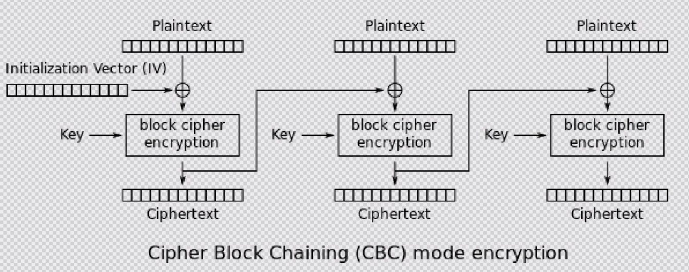
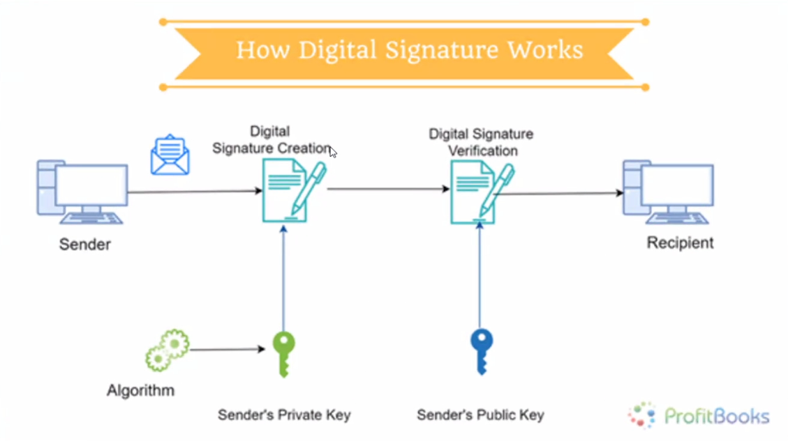

# SAP: Secure applications programming

## Symmetric Key Cryptography:

**Single Key:** Symmetric key cryptography, also known as secret-key or private-key cryptography, uses a single secret key for both encryption and decryption.

**Efficiency:** It is computationally efficient and faster than asymmetric key cryptography because the same key is used for both encryption and decryption processes.

**Examples:** Common symmetric key algorithms include DES (Data Encryption Standard), AES (Advanced Encryption Standard), and 3DES (Triple DES).


## Asymmetric Key Cryptography:

**Key Pairs:** Asymmetric key cryptography, also known as public-key cryptography, involves a pair of keys: a public key and a private key. The public key is shared openly, while the private key is kept secret.

**Encryption and Decryption:** The public key is used for encryption, and the private key is used for decryption. Messages encrypted with the public key can only be decrypted with the corresponding private key, and vice versa.

**Security:** Asymmetric cryptography provides a higher level of security compared to symmetric cryptography, especially in key distribution and exchange scenarios.

**Examples:** RSA (Rivest-Shamir-Adleman), ECC (Elliptic Curve Cryptography), and DSA (Digital Signature Algorithm) are common asymmetric key algorithms.


## Key Concepts:

**Public Key:** The public key is shared openly and is used for encryption. It is safe to distribute widely.

**Private Key:** The private key is kept secret and is used for decryption. It must be kept confidential to maintain the security of the communication.


## Use Cases:

**Symmetric key** cryptography is often used for encrypting large amounts of data or for securing communication channels where a shared secret key can be used.

**Asymmetric key** cryptography is commonly used for key exchange, digital signatures, and securing communication channels where the secure distribution of keys is challenging.


## Generating RSA (asymmetric public/private key):

- cmd -> ssh-keygen



- putty key generator (key-ul este encoded in base64, incepe dupa prefixul “ssh-rsa” si are marcator de final ==, “rsa-key-20231115” fiind sufix). Cand dai save public key, il salvezi ca si .cer



- keytool (merge doar cu jdk/java in env variables) Se poate realiza si mergand in “Java/jdk-11/bin” si se deschide aici cmd cat sa se foloseasca keytool.exe direct.

**Keytool command:**
```
keytool.exe -genkey -keyalg RSA -alias ismkey1 -keypass passism1 -storepass passks -keystore ismkeystore.ks -dname "cn=ISM, ou=ISM, o=IT&C Security Master, c=RO"
keytool.exe -genkey -keyalg RSA -alias ismkey2 -keypass passism2 -storepass passks -keystore ismkeystore.ks -dname "cn=ISM, ou=ISM, o=IT&C Security Master, c=RO"
keytool.exe -export -alias ismkey1 -file ISMCertificateX509.cer -keystore ismkeystore.ks -storepass passks   **(SE EXPORTA CHEIA PUBLICA: adica se genereaza certificatul)**
```

**Keytool adding certificate:**
```
keytool -importcert -file certificate.cer -keystore keystore.jks -alias "ismasero"    **(SE IMPORTA CHEIA PUBLICA)**
```

**Note:**
> keytool.exe -genkey -keyalg RSA -alias ismkey1 -keypass passism1 -storepass passks -keystore ismkeystore.ks -dname "cn=ISM, ou=ISM, o=IT&C Security Master, c=RO"

> Can be seen 2 levels of protection: -keypass: parola la cheia privata, -storepass: parola la store-ul care contine mai multe chestii. Ca o baza de date.


## OpenSSL installation

## **Variant 1** (whole system, but latest version)
```
git clone https://github.com/Microsoft/vcpkg
cd vcpkg
bootstrap-vcpkg.bat
vcpkg integrate install

vcpkg search ssl
vcpkg install openssl-windows --triplet x64-windows
```

**Note: Restart Visual Studio for changes to take effect.**


## **Variant 2** (local on the project, with the [binary bundle x86](https://portal.ism.ase.ro/mod/folder/view.php?id=450) / [instant download](https://portal.ism.ase.ro/pluginfile.php/1309/mod_folder/content/0/openssl111l-build.zip?forcedownload=1))

**ATTENTION: BEING THE BUNDLE ON 32 BIT, YOU HAVE TO USE THE X86 COMPILER NOT THE X64 ONE !!**







## CBC Figure


## Digital Signature


### **Workflow:**

1. **Sender (creates a message digest for the plain text)**:
> The sender uses a hash function to create a fixed-size message digest (hash value) from the original plain text.

2. **Message digest is encrypted with the private key of the sender**:
> The sender then encrypts the message digest with their private key. This process is known as creating a digital signature.

3.**Destination (recipient) receives plain text + the digital signature:**
> The recipient receives both the original plain text and the digital signature.

4. **Decrypts with the public key of the sender:**
> The recipient decrypts the received digital signature using the public key of the sender. This step ensures that only the sender, who possesses the corresponding private key, could have created this specific digital signature.

5. **Verifies the message digest:**
> After decrypting the digital signature, the recipient obtains the original message digest.

6 **Compares with the locally generated message digest:**
> The recipient independently generates a new message digest from the received plain text using the same hash function that the sender used.
> The recipient compares the decrypted message digest with the locally generated message digest. If they match, it verifies the integrity of the message and the authenticity of the sender.

**Note: Success.**
